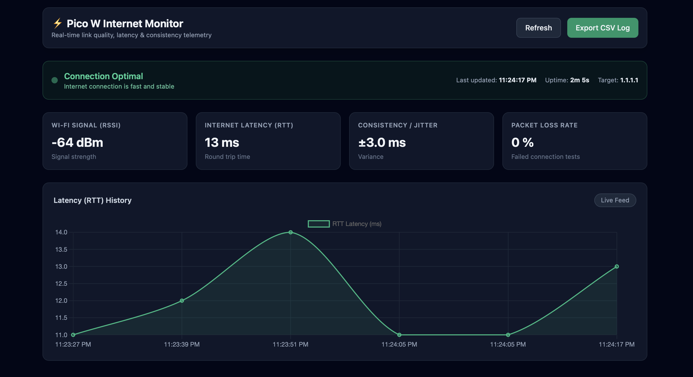

# Raspberry Pi Pico W Internet & Wi-Fi Monitor

A self-contained, real-time network health monitor powered by a Raspberry Pi Pico W running MicroPython. Plug it into a USB charger at home and check your Wi-Fi quality from your phone, anywhere in the world.



**Read the story behind it:** [Building a network monitor that works from anywhere](https://aabdullakh.github.io/blog/)

---

## What it measures

Every 10 seconds, the Pico records:

| Metric | What it tells you |
| --- | --- |
| **Wi-Fi signal (RSSI)** | How strong the Wi-Fi is where the Pico sits |
| **Latency** | How long a round trip to the internet takes, in ms |
| **Jitter** | How much latency varies across the 5 tests |
| **Packet loss** | Percent of 5 connection tests that failed |
| **Uptime** | How long the Pico has been running |

## How it works

```
┌──────────────────────┐     every 10s     ┌──────────────────────┐
│   Raspberry Pi       │ ───── HTTPS ────▶ │   Adafruit IO feed   │
│   Pico W (home)      │    POST reading   │   (public, cloud)    │
└──────────────────────┘                   └──────────┬───────────┘
                                                      │ polls every 10s
                                                      ▼
                                           ┌──────────────────────┐
                                           │ index.html dashboard │
                                           │ (GitHub Pages)       │
                                           └──────────────────────┘
```

1. **Measure:** `main.py` reads the Wi-Fi RSSI and times 5 TCP connections to `1.1.1.1:80`: the average is latency, the spread is jitter, and the share that failed is packet loss.
2. **Publish:** it posts each reading as JSON to a public [Adafruit IO](https://io.adafruit.com) feed called `intern-monitor`.
3. **Display:** `index.html` is a static page on GitHub Pages that polls the feed every 10 seconds. The feed is public, so the page needs no API key and no backend.
4. **Detect outages:** when the internet is down, the Pico can't post. If the newest reading is more than 60 seconds old, the dashboard shows **"Offline"**.

## What you need

- Raspberry Pi Pico W with MicroPython installed
- Micro-USB cable and any USB charger
- A free [Adafruit IO](https://io.adafruit.com) account
- A GitHub account (for hosting the dashboard)
- Python on your computer (for `mpremote`)

## Build your own

### 1. Get the code

Fork this repo, then clone your fork:

```bash
git clone https://github.com/<your-username>/pico_internet_monitor.git
cd pico_internet_monitor
```

### 2. Set up Adafruit IO

1. Sign in at [io.adafruit.com](https://io.adafruit.com).
2. Go to **Feeds → New Feed** and name it `intern-monitor`.
3. Open the feed's settings and set visibility to **Public**.
4. Click the key icon and copy your **username** and **Active Key**.

### 3. Add your secrets

```bash
cp config.example.py config.py
```

Fill in `config.py`:

```python
WIFI_SSID = "your-wifi-name"
WIFI_PASS = "your-wifi-password"
AIO_USER  = "your-adafruit-username"
AIO_KEY   = "your-adafruit-key"
```

> ⚠️ `config.py` is gitignored. **Never commit it.** It contains your Wi-Fi password and Adafruit key.

### 4. Point the dashboard at your feed

In `index.html`, set `AIO_USER` to your Adafruit username:

```javascript
const AIO_USER = "<your-adafruit-username>";
```

### 5. Flash the Pico

Plug the Pico into your computer, then:

```bash
pip install mpremote
mpremote cp main.py :main.py
mpremote cp config.py :config.py
mpremote reset
```

Open your `intern-monitor` feed on Adafruit IO. A new reading should appear about every 10 seconds.

### 6. Publish the dashboard

In your GitHub repo, go to **Settings → Pages → Deploy from a branch → `main` → `/ (root)`** and save. After a minute, GitHub gives you a link like `https://<your-username>.github.io/pico_internet_monitor/`.

### 7. Plug it in

Unplug the Pico from your computer and plug it into any USB charger at home. It starts on its own. Open your dashboard link from your phone.

## Updating the Pico

After editing `main.py` or `config.py`:

```bash
mpremote cp main.py :main.py
mpremote cp config.py :config.py   # only if config.py changed
mpremote reset
```

To watch live serial output for debugging, run `mpremote connect <port>`. The loop resumes after the next `mpremote reset`.

## Troubleshooting

| Problem | Check |
| --- | --- |
| Dashboard always says **Offline** | Is the Pico powered and on Wi-Fi? Are new readings appearing in your Adafruit feed? |
| No readings in the feed | Check `config.py` values, then watch the serial output with `mpremote connect`. |
| Dashboard shows nothing | Is the feed set to **Public**? Is your username correct in `index.html`? |
| "Too many requests" from Adafruit | The free plan allows 30 posts per minute. Keep the interval at 10 seconds or more. |

You can check the latest raw reading in any browser (look at `last_value` and `updated_at`):
`https://io.adafruit.com/api/v2/<your-adafruit-username>/feeds/intern-monitor`

## Tech stack

MicroPython · Raspberry Pi Pico W · Adafruit IO · HTML/CSS/JavaScript · GitHub Pages

## Author

Built by [Abdullakh Abshukur](https://aabdullakh.github.io), with Claude as a pair programmer.
